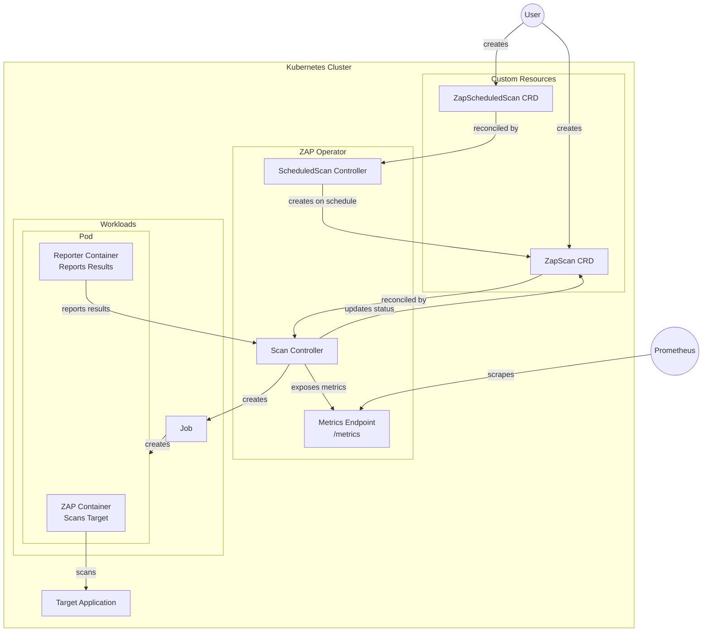

# Zap Operator


Zap Operator is a Kubernetes operator that automates [OWASP ZAP](https://www.zaproxy.org/) security scanning of your applications. It provides Custom Resource Definitions (CRDs) for running on-demand and scheduled security scans directly within your Kubernetes cluster.

## Motivation

Security scanning is a critical part of the software development lifecycle. OWASP ZAP is one of the most popular open-source security testing tools, but integrating it into Kubernetes-native workflows can be challenging.

Zap Operator solves this by:

- **Kubernetes-Native**: Define scans as Kubernetes resources using familiar YAML manifests
- **Automated Scheduling**: Run scans on a cron schedule with `ZapScheduledScan`
- **GitOps Friendly**: Store scan configurations in Git alongside your application manifests
- **Observable**: Prometheus metrics for alerts found, scan duration, and scan status
- **Simple**: No external dependencies - just deploy the operator and create scan resources

## Deployment

```bash
helm repo add nccloud https://nccloud.github.io/charts
helm install zap-operator nccloud/zap-operator
```

## Usage

### One-Time Scan

Create a `ZapScan` resource to run a one-time security scan:

```yaml
apiVersion: zap.spaceship.com/v1alpha1
kind: ZapScan
metadata:
  name: example-scan
spec:
  target: "https://example.com"
```

### Scheduled Scan

Create a `ZapScheduledScan` resource to run scans on a schedule:

```yaml
apiVersion: zap.spaceship.com/v1alpha1
kind: ZapScheduledScan
metadata:
  name: nightly-scan
spec:
  schedule: "0 2 * * *" # Run at 2 AM daily
  template:
    target: "https://example.com"
```

### Advanced Configuration

```yaml
apiVersion: zap.spaceship.com/v1alpha1
kind: ZapScan
metadata:
  name: advanced-scan
spec:
  target: "https://api.example.com"
  openapi: "https://api.example.com/openapi.json" # Import OpenAPI spec
  image: "ghcr.io/zaproxy/zaproxy:stable" # Custom ZAP image
  args: # Extra zap-full-scan.py args
    - "-a"
  serviceAccountName: "zap-scanner" # Custom service account
  cleanup: true # Delete Job after completion
```

## How It Works

1. **Create Scan Resource**: You create a `ZapScan` or `ZapScheduledScan` custom resource
2. **Job Creation**: The operator creates a Kubernetes Job running the official ZAP container
3. **Scan Execution**: ZAP performs a full scan against the target URL using `zap-full-scan.py`
4. **Results Collection**: The operator collects scan results (JSON report) from the Job
5. **Status Update**: Scan status is updated with alert count, duration, and any errors
6. **Metrics Export**: Prometheus metrics are exported for monitoring and alerting

### Architecture



## CRD Reference

### ZapScan

| Field                     | Type     | Required | Description                                                     |
| ------------------------- | -------- | -------- | --------------------------------------------------------------- |
| `spec.target`             | string   | Yes      | URL to scan (e.g., `https://example.com`)                       |
| `spec.openapi`            | string   | No       | URL or path to OpenAPI specification                            |
| `spec.image`              | string   | No       | ZAP container image (default: `ghcr.io/zaproxy/zaproxy:stable`) |
| `spec.args`               | []string | No       | Extra arguments for `zap-full-scan.py`                          |
| `spec.jobNamespace`       | string   | No       | Namespace for the scan Job (default: same as ZapScan)           |
| `spec.serviceAccountName` | string   | No       | Service account for the scan Job                                |
| `spec.cleanup`            | bool     | No       | Delete Job after completion                                     |

### ZapScheduledScan

| Field                    | Type        | Required | Description                                         |
| ------------------------ | ----------- | -------- | --------------------------------------------------- |
| `spec.schedule`          | string      | Yes      | Cron expression (e.g., `0 2 * * *`)                 |
| `spec.template`          | ZapScanSpec | Yes      | Template for created ZapScan resources              |
| `spec.suspend`           | bool        | No       | Suspend scheduling                                  |
| `spec.concurrencyPolicy` | string      | No       | `Allow`, `Forbid`, or `Replace` (default: `Forbid`) |

## Metrics

The operator exports the following Prometheus metrics:

| Metric                                     | Type      | Description                 |
| ------------------------------------------ | --------- | --------------------------- |
| `zap_operator_alerts_found_total`          | Counter   | Total alerts found by scans |
| `zap_operator_scan_runs_total`             | Counter   | Total scan runs (by status) |
| `zap_operator_scan_duration_seconds`       | Histogram | Scan duration distribution  |
| `zap_operator_scans_in_progress`           | Gauge     | Currently running scans     |
| `zap_operator_last_scan_timestamp_seconds` | Gauge     | Timestamp of last scan      |

## Versioning

We use [SemVer](http://semver.org/) for versioning. For available versions, see the [releases](https://github.com/NCCloud/zap-operator/releases) page.

## Contribution

We welcome contributions, issues, and feature requests!

Please refer to our [contribution guidelines](CONTRIBUTING.md) for details.

## License

[Apache 2.0 License](./LICENSE)

---

<br>
Made with &#10084; by [Namecheap Cloud Team](https://github.com/NCCloud)
